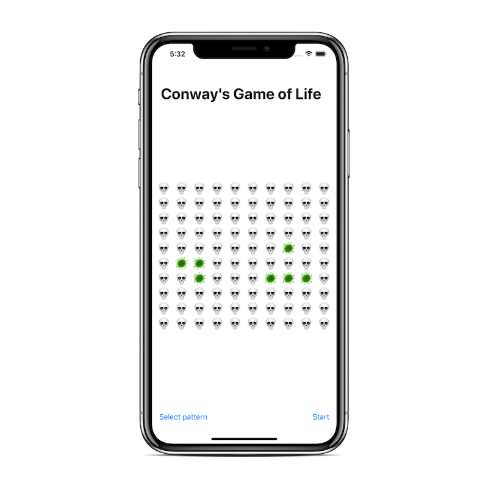

# Conway's Game of Life

Conway's Game of Life is an evolutionary game that requires no user input other than the initial state of the board. The game consists of a grid of cells that can either be alive or dead and follow a few rules to determine their next generation. These rules are:

- An alive cell with fewer than two neighbors will be dead in the next generation.
- An alive cell with two or three alive neighbors will remain alive in the next generation.
- An alive cell with more than three neighbors will be dead in the next generation.
- A dead cell with exactly three alive neighbors will come back to life in the next generation.

This repository contains a solution that:

- Uses [Bow](https://bow-swift.io/), a library for FP written in Swift, and solves the challenge using [Comonads](https://bow-swift.io/next/api-docs/Protocols/Comonad.html).
- Uses [SwiftUI](https://developer.apple.com/xcode/swiftui/) to provide a graphical visualization of the game.
- Uses [SwiftCheck](https://github.com/typelift/SwiftCheck), a library for Property-based Testing written in Swift, to test the solution.

Here you have a screenshot of the final result:

